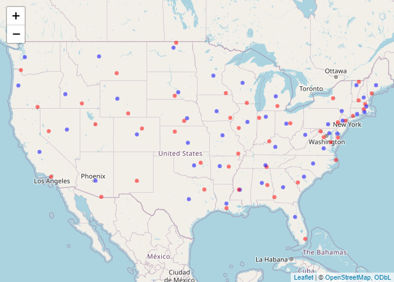

Lab 05 - Data Wrangling
================

# Learning goals

- Use the `merge()` function to join two datasets.
- Deal with missings and impute data.
- Identify relevant observations using `quantile()`.
- Practice your GitHub skills.

# Lab description

For this lab we will be dealing with the meteorological dataset `met`.
In this case, we will use `data.table` to answer some questions
regarding the `met` dataset, while at the same time practice your
Git+GitHub skills for this project.

This markdown document should be rendered using `github_document`
document.

# Part 1: Setup a Git project and the GitHub repository

1.  Go to wherever you are planning to store the data on your computer,
    and create a folder for this project

2.  In that folder, save [this
    template](https://github.com/JSC370/JSC370-2024/blob/main/labs/lab05/lab05-wrangling-gam.Rmd)
    as “README.Rmd”. This will be the markdown file where all the magic
    will happen.

3.  Go to your GitHub account and create a new repository of the same
    name that your local folder has, e.g., “JSC370-labs”.

4.  Initialize the Git project, add the “README.Rmd” file, and make your
    first commit.

5.  Add the repo you just created on GitHub.com to the list of remotes,
    and push your commit to origin while setting the upstream.

Most of the steps can be done using command line:

``` sh
# Step 1
cd ~/Documents
mkdir JSC370-labs
cd JSC370-labs

# Step 2
wget https://raw.githubusercontent.com/JSC370/JSC370-2024/main/labs/lab05/lab05-wrangling-gam.Rmd
mv lab05-wrangling-gam.Rmd README.Rmd
# if wget is not available,
curl https://raw.githubusercontent.com/JSC370/JSC370-2024/main/labs/lab05/lab05-wrangling-gam.Rmd --output README.Rmd

# Step 3
# Happens on github

# Step 4
git init
git add README.Rmd
git commit -m "First commit"

# Step 5
git remote add origin git@github.com:[username]/JSC370-labs
git push -u origin master
```

You can also complete the steps in R (replace with your paths/username
when needed)

``` r
# Step 1
setwd("~/Documents")
dir.create("JSC370-labs")
setwd("JSC370-labs")

# Step 2
download.file(
  "https://raw.githubusercontent.com/JSC370/JSC370-2024/main/labs/lab05/lab05-wrangling-gam.Rmd",
  destfile = "README.Rmd"
  )

# Step 3: Happens on Github

# Step 4
system("git init && git add README.Rmd")
system('git commit -m "First commit"')

# Step 5
system("git remote add origin git@github.com:[username]/JSC370-labs")
system("git push -u origin master")
```

Once you are done setting up the project, you can now start working with
the MET data.

## Setup in R

1.  Load the `data.table` (and the `dtplyr` and `dplyr` packages),
    `mgcv`, `ggplot2`, `leaflet`, `kableExtra`.

``` r
library(data.table)
library(dtplyr)
library(dplyr)
```

    ## 
    ## Attaching package: 'dplyr'

    ## The following objects are masked from 'package:data.table':
    ## 
    ##     between, first, last

    ## The following objects are masked from 'package:stats':
    ## 
    ##     filter, lag

    ## The following objects are masked from 'package:base':
    ## 
    ##     intersect, setdiff, setequal, union

``` r
library(mgcv)
```

    ## Loading required package: nlme

    ## 
    ## Attaching package: 'nlme'

    ## The following object is masked from 'package:dplyr':
    ## 
    ##     collapse

    ## This is mgcv 1.9-0. For overview type 'help("mgcv-package")'.

``` r
library(ggplot2)
library(leaflet)
library(kableExtra)
```

    ## 
    ## Attaching package: 'kableExtra'

    ## The following object is masked from 'package:dplyr':
    ## 
    ##     group_rows

``` r
fn <- "https://raw.githubusercontent.com/JSC370/JSC370-2024/main/data/met_all_2023.gz"
if (!file.exists("met_all_2023.gz"))
  download.file(fn, destfile = "met_all_2023.gz")
met <- data.table::fread("met_all_2023.gz")
```

2.  Load the met data from
    <https://github.com/JSC370/JSC370-2024/main/data/met_all_2023.gz> or
    (Use
    <https://raw.githubusercontent.com/JSC370/JSC370-2024/main/data/met_all_2023.gz>
    to download programmatically), and also the station data. For the
    latter, you can use the code we used during lecture to pre-process
    the stations data:

``` r
# Download the data
stations <- fread("ftp://ftp.ncdc.noaa.gov/pub/data/noaa/isd-history.csv")
stations[, USAF := as.integer(USAF)]
```

    ## Warning in eval(jsub, SDenv, parent.frame()): NAs introduced by coercion

``` r
# Dealing with NAs and 999999
stations[, USAF   := fifelse(USAF == 999999, NA_integer_, USAF)]
stations[, CTRY   := fifelse(CTRY == "", NA_character_, CTRY)]
stations[, STATE  := fifelse(STATE == "", NA_character_, STATE)]

# Selecting the three relevant columns, and keeping unique records
stations <- unique(stations[, list(USAF, CTRY, STATE, LAT, LON)])

# Dropping NAs
stations <- stations[!is.na(USAF)]

# Removing duplicates
stations[, n := 1:.N, by = .(USAF)]
stations <- stations[n == 1,][, n := NULL]

# Read in the met data and fix lat, lon, temp
# Read in the met data and fix lat, lon, temp
met$lat <- met$lat/1000
met$lon <- met$lon/1000
met$wind.sp <- met$wind.sp/10
met$temp <- met$temp/10
met$dew.point <- met$dew.point/10
met$atm.press <- met$atm.press/10
```

3.  Merge the data as we did during the lecture. Use the `merge()` code
    and you can also try the tidy way with `left_join()`

``` r
met_dt <- merge(
  # Data
  x     = met,      
  y     = stations, 
  # List of variables to match
  by.x  = "USAFID",
  by.y  = "USAF", 
  # Which obs to keep?
  all.x = TRUE,      
  all.y = FALSE
)
```

## Question 1: Identifying Representative Stations

Across all weather stations, which stations have the median values of
temperature, wind speed, and atmospheric pressure? Using the
`quantile()` function, identify these three stations. Do they coincide?

``` r
med_temp <- quantile(met_dt$temp, 0.5, na.rm = TRUE)
med_ws <- quantile(met_dt$wind.sp, 0.5, na.rm = TRUE)
med_atp <- quantile(met_dt$atm.press, 0.5, na.rm = TRUE)

med_temp
```

    ##  50% 
    ## 21.7

``` r
med_atp
```

    ##    50% 
    ## 1011.7

``` r
med_ws
```

    ## 50% 
    ## 3.1

Next identify the stations have these median values.

``` r
med_met <- met_dt[, .(
  temp = median(temp, na.rm = TRUE),
  atm.press = median(atm.press, na.rm = TRUE),
  wind.sp = median(wind.sp, na.rm = TRUE)
), by = c("USAFID", "STATE")]


med_met[, temp_d:= abs(temp-med_temp)]
med_temp_stat <- med_met[temp_d==0]

med_met[, ws_d:= abs(wind.sp-med_ws)]
med_ws_stat <- med_met[ws_d==0]

med_met[, atp_d:= abs(atm.press-med_atp)]
med_atp_stat <- med_met[atp_d==0]

print("The stations that attain the median temperature are:")
```

    ## [1] "The stations that attain the median temperature are:"

``` r
unique(med_temp_stat)
```

    ##     USAFID STATE temp atm.press wind.sp temp_d
    ##  1: 720263    GA 21.7        NA    2.60      0
    ##  2: 720312    IA 21.7        NA    2.60      0
    ##  3: 720327    WI 21.7        NA    4.60      0
    ##  4: 722076    IL 21.7        NA    3.60      0
    ##  5: 722180    GA 21.7   1010.70    3.10      0
    ##  6: 722196    GA 21.7   1010.60    2.85      0
    ##  7: 722197    GA 21.7   1011.60    2.60      0
    ##  8: 723075    VA 21.7   1011.40    4.10      0
    ##  9: 723086    VA 21.7   1011.50    3.60      0
    ## 10: 723110    GA 21.7   1011.20    2.60      0
    ## 11: 723119    SC 21.7   1011.70    3.10      0
    ## 12: 723190    SC 21.7   1011.10    3.10      0
    ## 13: 723194    NC 21.7   1011.95    3.10      0
    ## 14: 723200    GA 21.7   1010.60    2.10      0
    ## 15: 723658    NM 21.7   1011.70    3.60      0
    ## 16: 723895    CA 21.7   1011.80    3.10      0
    ## 17: 724010    VA 21.7   1011.70    3.60      0
    ## 18: 724345    MO 21.7   1011.30    3.10      0
    ## 19: 724356    IN 21.7   1011.90    3.60      0
    ## 20: 724365    IN 21.7   1012.00    3.10      0
    ## 21: 724373    IN 21.7   1012.10    3.10      0
    ## 22: 724380    IN 21.7   1012.20    4.10      0
    ## 23: 724397    IL 21.7   1012.70    4.10      0
    ## 24: 724454    MO 21.7   1013.20    3.10      0
    ## 25: 724517    KS 21.7   1011.40    4.10      0
    ## 26: 724585    KS 21.7   1010.80    4.10      0
    ## 27: 724815    CA 21.7   1011.60    3.10      0
    ## 28: 724838    CA 21.7   1011.90    3.60      0
    ## 29: 725116    PA 21.7   1010.30    3.10      0
    ## 30: 725317    IL 21.7   1012.00    3.60      0
    ## 31: 725326    IL 21.7    999.70    3.10      0
    ## 32: 725340    IL 21.7   1012.20    4.10      0
    ## 33: 725450    IA 21.7   1012.35    3.60      0
    ## 34: 725472    IA 21.7   1012.00    3.60      0
    ## 35: 725473    IA 21.7   1013.40    3.60      0
    ## 36: 725480    IA 21.7   1012.20    3.10      0
    ## 37: 725499    IA 21.7   1012.00    2.60      0
    ## 38: 725513    NE 21.7        NA    3.10      0
    ## 39: 725720    UT 21.7   1009.60    3.60      0
    ## 40: 726515    SD 21.7   1013.10    4.10      0
    ## 41: 726525    SD 21.7   1012.80    3.60      0
    ## 42: 726546    SD 21.7   1011.30    3.85      0
    ## 43: 726556    MN 21.7   1012.15    3.60      0
    ## 44: 726560    SD 21.7   1010.35    4.10      0
    ## 45: 727570    ND 21.7   1011.45    3.60      0
    ## 46: 727845    WA 21.7   1012.40    3.10      0
    ## 47: 727900    WA 21.7   1012.00    3.60      0
    ## 48: 745046    CA 21.7   1011.80    3.60      0
    ## 49: 746410    OK 21.7   1010.10    4.10      0
    ## 50: 747808    GA 21.7   1012.60    2.60      0
    ##     USAFID STATE temp atm.press wind.sp temp_d

``` r
print("The stations that attain the median atm pressure are:")
```

    ## [1] "The stations that attain the median atm pressure are:"

``` r
unique(med_atp_stat)
```

    ##     USAFID STATE temp atm.press wind.sp temp_d ws_d atp_d
    ##  1: 720394    AR 23.9    1011.7     2.1    2.2  1.0     0
    ##  2: 722085    SC 24.4    1011.7     3.1    2.7  0.0     0
    ##  3: 722348    MS 24.4    1011.7     2.1    2.7  1.0     0
    ##  4: 723119    SC 21.7    1011.7     3.1    0.0  0.0     0
    ##  5: 723124    SC 21.1    1011.7     2.6    0.6  0.5     0
    ##  6: 723270    TN 23.9    1011.7     3.1    2.2  0.0     0
    ##  7: 723658    NM 21.7    1011.7     3.6    0.0  0.5     0
    ##  8: 724010    VA 21.7    1011.7     3.6    0.0  0.5     0
    ##  9: 724035    VA 22.2    1011.7     3.6    0.5  0.5     0
    ## 10: 724100    VA 19.4    1011.7     3.1    2.3  0.0     0
    ## 11: 724235    KY 21.1    1011.7     3.1    0.6  0.0     0
    ## 12: 724280    OH 20.6    1011.7     3.6    1.1  0.5     0
    ## 13: 724336    IL 23.3    1011.7     3.1    1.6  0.0     0
    ## 14: 724926    CA 20.6    1011.7     4.1    1.1  1.0     0
    ## 15: 725126    PA 18.3    1011.7     3.1    3.4  0.0     0
    ## 16: 725266    PA 16.1    1011.7     3.1    5.6  0.0     0
    ## 17: 725510    NE 23.9    1011.7     3.6    2.2  0.5     0
    ## 18: 725570    IA 22.2    1011.7     3.1    0.5  0.0     0
    ## 19: 725620    NE 20.6    1011.7     3.6    1.1  0.5     0
    ## 20: 725845    CA 14.4    1011.7     2.6    7.3  0.5     0
    ## 21: 726690    WY 13.3    1011.7     4.6    8.4  1.5     0
    ## 22: 726810    ID 20.0    1011.7     3.1    1.7  0.0     0
    ##     USAFID STATE temp atm.press wind.sp temp_d ws_d atp_d

``` r
print("The stations that attain the median wind speed are:")
```

    ## [1] "The stations that attain the median wind speed are:"

``` r
unique(med_ws_stat)
```

    ##      USAFID STATE temp atm.press wind.sp temp_d ws_d
    ##   1: 720110    TX 28.0        NA     3.1    6.3    0
    ##   2: 720113    MI 20.0        NA     3.1    1.7    0
    ##   3: 720258    MN 18.0        NA     3.1    3.7    0
    ##   4: 720261    TX 27.7        NA     3.1    6.0    0
    ##   5: 720266    IN 18.5        NA     3.1    3.2    0
    ##  ---                                                
    ## 573: 747680    MS 25.0    1011.4     3.1    3.3    0
    ## 574: 747760    FL 23.9    1011.4     3.1    2.2    0
    ## 575: 747809    GA 22.0        NA     3.1    0.3    0
    ## 576: 747900    SC 22.8    1011.1     3.1    1.1    0
    ## 577: 747918    SC 23.0        NA     3.1    1.3    0

``` r
all_measures <- med_met[temp_d== 0 & ws_d==0 & atp_d==0]
print("The stations that coincide at all three are:")
```

    ## [1] "The stations that coincide at all three are:"

``` r
unique(all_measures)
```

    ##    USAFID STATE temp atm.press wind.sp temp_d ws_d atp_d
    ## 1: 723119    SC 21.7    1011.7     3.1      0    0     0

As as can see above, the values all coincide for the station with
USAFID: 723119.

Knit the document, commit your changes, and save it on GitHub. Don’t
forget to add `README.md` to the tree, the first time you render it.

## Question 2: Identifying Representative Stations per State

Now let’s find the weather stations by state with closest temperature
and wind speed based on the euclidean distance from these medians.

``` r
state_weather <- met_dt[, .(
  state_temp = median(temp, na.rm = TRUE),
  state_wind.sp = median(wind.sp, na.rm = TRUE)
), by = c("STATE")]

euclidean <- merge(state_weather, med_met, by = "STATE")
euclidean[, distance:= sqrt((temp-state_temp)^2 + (wind.sp-state_wind.sp)^2)]
euclidean <- euclidean[!is.na(distance)]
state_reps <- euclidean[, .(min_distance = min(distance), USAFID = USAFID[which.min(distance)]), by = c("STATE")]
state_reps[, .(STATE, USAFID)]
```

    ##     STATE USAFID
    ##  1:    AL 720265
    ##  2:    AR 722188
    ##  3:    AZ 722728
    ##  4:    CA 722950
    ##  5:    CO 724695
    ##  6:    CT 725040
    ##  7:    DE 724093
    ##  8:    FL 722024
    ##  9:    GA 720257
    ## 10:    IA 720309
    ## 11:    ID 725867
    ## 12:    IL 744666
    ## 13:    IN 744660
    ## 14:    KS 724655
    ## 15:    KY 724235
    ## 16:    LA 720587
    ## 17:    MA 725059
    ## 18:    MD 725514
    ## 19:    ME 726060
    ## 20:    MI 725395
    ## 21:    MN 720283
    ## 22:    MO 723300
    ## 23:    MS 722354
    ## 24:    MT 726770
    ## 25:    NC 720282
    ## 26:    ND 720853
    ## 27:    NE 725525
    ## 28:    NH 726165
    ## 29:    NJ 720581
    ## 30:    NM 722683
    ## 31:    NV 724885
    ## 32:    NY 725190
    ## 33:    OH 720414
    ## 34:    OK 722164
    ## 35:    OR 725976
    ## 36:    PA 720324
    ## 37:    RI 725054
    ## 38:    SC 720602
    ## 39:    SD 726518
    ## 40:    TN 720974
    ## 41:    TX 722448
    ## 42:    UT 725724
    ## 43:    VA 724036
    ## 44:    VT 720493
    ## 45:    WA 727924
    ## 46:    WI 726415
    ## 47:    WV 724177
    ## 48:    WY 720521
    ##     STATE USAFID

Knit the doc and save it on GitHub.

## Question 3: In the Geographic Center?

For each state, identify which station is closest to the geographic
mid-point (median) of the state. Combining these with the stations you
identified in the previous question, use `leaflet()` to visualize all
~100 points in the same figure, applying different colors for the
geographic median and the temperature and wind speed median.

``` r
med_stat <- met_dt[, .(
  mlon = median(lon, na.rm = TRUE),
  mlat = median(lat, na.rm = TRUE)
), by = c("STATE")]

med_stat.info <- merge(met_dt[, c("USAFID", "STATE", "lat", "lon")], med_stat, by.x = "STATE", by.y = "STATE")
med_stat.info[, mid_dist:=sqrt((lon-mlon)^2+(lat-mlat)^2)]
med_stat <- med_stat.info[ , .SD[which.min(mid_dist)], by = c("STATE")]

met_dt.filtered <- met_dt[met_dt$USAFID %in% med_stat$USAFID | met_dt$USAFID %in% state_reps$USAFID]
met_dt.filtered$state_rep <- ifelse(met_dt.filtered$USAFID %in% state_reps$USAFID, 1, 0)
met_dt.filtered$median_stat <- ifelse(met_dt.filtered$USAFID %in% med_stat$USAFID, 1, 0)

met_dt.filtered <- met_dt.filtered[, .(
  lon = mean(lon, na.rm = TRUE),
  lat = mean(lat, na.rm = TRUE),
  state_rep = first(state_rep),
  median_stat = first(median_stat)
), by = c("USAFID")]

leaflet() %>%
  addTiles() %>%
  addCircles(data = met_dt.filtered, 
                   lat = ~lat, 
                   lng = ~lon, 
                   radius = 5, 
                   color = ~ifelse(state_rep == 1, "red", 
                                   ifelse(median_stat == 1, "blue", "green")))
```

<!-- -->

``` r
#install.packages("webshot")
webshot::install_phantomjs()
```

    ## It seems that the version of `phantomjs` installed is greater than or equal to the requested version.To install the requested version or downgrade to another version, use `force = TRUE`.

Knit the doc and save it on GitHub.

## Question 4: Summary Table with `kableExtra`

Generate a summary table using `kable` where the rows are each state and
the columns represent average temperature broken down by low, median,
and high elevation stations.

Use the following breakdown for elevation:

- Low: elev \< 93
- Mid: elev \>= 93 and elev \< 401
- High: elev \>= 401

``` r
met_dt$elev.cat <- ifelse(met_dt$elev < 93, "low", ifelse(met_dt$elev >= 93 & met_dt$elev < 401, "mid", ifelse(met_dt$elev >= 401, "high", NA)))

summary_table <- met_dt[, .(
  avg_temp = mean(temp, na.rm = TRUE),
  count = .N
), by = c("STATE", "elev.cat")]

kable(summary_table, format = "html", caption = "Avg Temperature by State and Elevation Category")
```

<table>
<caption>
Avg Temperature by State and Elevation Category
</caption>
<thead>
<tr>
<th style="text-align:left;">
STATE
</th>
<th style="text-align:left;">
elev.cat
</th>
<th style="text-align:right;">
avg_temp
</th>
<th style="text-align:right;">
count
</th>
</tr>
</thead>
<tbody>
<tr>
<td style="text-align:left;">
CA
</td>
<td style="text-align:left;">
high
</td>
<td style="text-align:right;">
18.148808
</td>
<td style="text-align:right;">
34873
</td>
</tr>
<tr>
<td style="text-align:left;">
TX
</td>
<td style="text-align:left;">
mid
</td>
<td style="text-align:right;">
28.080212
</td>
<td style="text-align:right;">
121694
</td>
</tr>
<tr>
<td style="text-align:left;">
MI
</td>
<td style="text-align:left;">
mid
</td>
<td style="text-align:right;">
18.544315
</td>
<td style="text-align:right;">
109821
</td>
</tr>
<tr>
<td style="text-align:left;">
SC
</td>
<td style="text-align:left;">
low
</td>
<td style="text-align:right;">
23.684074
</td>
<td style="text-align:right;">
46499
</td>
</tr>
<tr>
<td style="text-align:left;">
IL
</td>
<td style="text-align:left;">
mid
</td>
<td style="text-align:right;">
22.117068
</td>
<td style="text-align:right;">
79152
</td>
</tr>
<tr>
<td style="text-align:left;">
TX
</td>
<td style="text-align:left;">
high
</td>
<td style="text-align:right;">
26.500393
</td>
<td style="text-align:right;">
67075
</td>
</tr>
<tr>
<td style="text-align:left;">
MO
</td>
<td style="text-align:left;">
mid
</td>
<td style="text-align:right;">
23.776523
</td>
<td style="text-align:right;">
37283
</td>
</tr>
<tr>
<td style="text-align:left;">
AR
</td>
<td style="text-align:left;">
mid
</td>
<td style="text-align:right;">
24.405779
</td>
<td style="text-align:right;">
16596
</td>
</tr>
<tr>
<td style="text-align:left;">
AR
</td>
<td style="text-align:left;">
low
</td>
<td style="text-align:right;">
25.586981
</td>
<td style="text-align:right;">
13050
</td>
</tr>
<tr>
<td style="text-align:left;">
OR
</td>
<td style="text-align:left;">
low
</td>
<td style="text-align:right;">
15.203183
</td>
<td style="text-align:right;">
13332
</td>
</tr>
<tr>
<td style="text-align:left;">
WA
</td>
<td style="text-align:left;">
low
</td>
<td style="text-align:right;">
15.251930
</td>
<td style="text-align:right;">
17491
</td>
</tr>
<tr>
<td style="text-align:left;">
GA
</td>
<td style="text-align:left;">
low
</td>
<td style="text-align:right;">
24.805291
</td>
<td style="text-align:right;">
41197
</td>
</tr>
<tr>
<td style="text-align:left;">
MN
</td>
<td style="text-align:left;">
mid
</td>
<td style="text-align:right;">
21.155231
</td>
<td style="text-align:right;">
126490
</td>
</tr>
<tr>
<td style="text-align:left;">
GA
</td>
<td style="text-align:left;">
mid
</td>
<td style="text-align:right;">
23.238409
</td>
<td style="text-align:right;">
58952
</td>
</tr>
<tr>
<td style="text-align:left;">
AL
</td>
<td style="text-align:left;">
mid
</td>
<td style="text-align:right;">
23.797753
</td>
<td style="text-align:right;">
28602
</td>
</tr>
<tr>
<td style="text-align:left;">
IN
</td>
<td style="text-align:left;">
mid
</td>
<td style="text-align:right;">
20.127309
</td>
<td style="text-align:right;">
42207
</td>
</tr>
<tr>
<td style="text-align:left;">
TX
</td>
<td style="text-align:left;">
low
</td>
<td style="text-align:right;">
28.744620
</td>
<td style="text-align:right;">
56699
</td>
</tr>
<tr>
<td style="text-align:left;">
NC
</td>
<td style="text-align:left;">
low
</td>
<td style="text-align:right;">
22.829453
</td>
<td style="text-align:right;">
62955
</td>
</tr>
<tr>
<td style="text-align:left;">
NC
</td>
<td style="text-align:left;">
mid
</td>
<td style="text-align:right;">
21.210730
</td>
<td style="text-align:right;">
51801
</td>
</tr>
<tr>
<td style="text-align:left;">
VA
</td>
<td style="text-align:left;">
low
</td>
<td style="text-align:right;">
21.348262
</td>
<td style="text-align:right;">
38279
</td>
</tr>
<tr>
<td style="text-align:left;">
IA
</td>
<td style="text-align:left;">
mid
</td>
<td style="text-align:right;">
22.262278
</td>
<td style="text-align:right;">
96728
</td>
</tr>
<tr>
<td style="text-align:left;">
PA
</td>
<td style="text-align:left;">
low
</td>
<td style="text-align:right;">
20.341855
</td>
<td style="text-align:right;">
4249
</td>
</tr>
<tr>
<td style="text-align:left;">
NE
</td>
<td style="text-align:left;">
mid
</td>
<td style="text-align:right;">
23.485978
</td>
<td style="text-align:right;">
17211
</td>
</tr>
<tr>
<td style="text-align:left;">
ID
</td>
<td style="text-align:left;">
high
</td>
<td style="text-align:right;">
16.415667
</td>
<td style="text-align:right;">
25107
</td>
</tr>
<tr>
<td style="text-align:left;">
PA
</td>
<td style="text-align:left;">
mid
</td>
<td style="text-align:right;">
19.405269
</td>
<td style="text-align:right;">
28202
</td>
</tr>
<tr>
<td style="text-align:left;">
WI
</td>
<td style="text-align:left;">
mid
</td>
<td style="text-align:right;">
19.565627
</td>
<td style="text-align:right;">
70589
</td>
</tr>
<tr>
<td style="text-align:left;">
WV
</td>
<td style="text-align:left;">
high
</td>
<td style="text-align:right;">
17.492150
</td>
<td style="text-align:right;">
7353
</td>
</tr>
<tr>
<td style="text-align:left;">
CA
</td>
<td style="text-align:left;">
mid
</td>
<td style="text-align:right;">
18.770705
</td>
<td style="text-align:right;">
27360
</td>
</tr>
<tr>
<td style="text-align:left;">
MD
</td>
<td style="text-align:left;">
mid
</td>
<td style="text-align:right;">
20.622545
</td>
<td style="text-align:right;">
6535
</td>
</tr>
<tr>
<td style="text-align:left;">
AZ
</td>
<td style="text-align:left;">
high
</td>
<td style="text-align:right;">
23.892609
</td>
<td style="text-align:right;">
26864
</td>
</tr>
<tr>
<td style="text-align:left;">
OK
</td>
<td style="text-align:left;">
high
</td>
<td style="text-align:right;">
24.000040
</td>
<td style="text-align:right;">
20544
</td>
</tr>
<tr>
<td style="text-align:left;">
WY
</td>
<td style="text-align:left;">
high
</td>
<td style="text-align:right;">
13.748173
</td>
<td style="text-align:right;">
33660
</td>
</tr>
<tr>
<td style="text-align:left;">
LA
</td>
<td style="text-align:left;">
low
</td>
<td style="text-align:right;">
27.618194
</td>
<td style="text-align:right;">
47046
</td>
</tr>
<tr>
<td style="text-align:left;">
KY
</td>
<td style="text-align:left;">
mid
</td>
<td style="text-align:right;">
21.361029
</td>
<td style="text-align:right;">
30259
</td>
</tr>
<tr>
<td style="text-align:left;">
OK
</td>
<td style="text-align:left;">
mid
</td>
<td style="text-align:right;">
25.076760
</td>
<td style="text-align:right;">
57603
</td>
</tr>
<tr>
<td style="text-align:left;">
AL
</td>
<td style="text-align:left;">
low
</td>
<td style="text-align:right;">
25.071063
</td>
<td style="text-align:right;">
14590
</td>
</tr>
<tr>
<td style="text-align:left;">
OR
</td>
<td style="text-align:left;">
mid
</td>
<td style="text-align:right;">
16.391003
</td>
<td style="text-align:right;">
4857
</td>
</tr>
<tr>
<td style="text-align:left;">
MN
</td>
<td style="text-align:left;">
high
</td>
<td style="text-align:right;">
19.931963
</td>
<td style="text-align:right;">
38908
</td>
</tr>
<tr>
<td style="text-align:left;">
FL
</td>
<td style="text-align:left;">
low
</td>
<td style="text-align:right;">
26.614842
</td>
<td style="text-align:right;">
94317
</td>
</tr>
<tr>
<td style="text-align:left;">
MD
</td>
<td style="text-align:left;">
low
</td>
<td style="text-align:right;">
21.254624
</td>
<td style="text-align:right;">
18056
</td>
</tr>
<tr>
<td style="text-align:left;">
WA
</td>
<td style="text-align:left;">
mid
</td>
<td style="text-align:right;">
17.805419
</td>
<td style="text-align:right;">
12745
</td>
</tr>
<tr>
<td style="text-align:left;">
OH
</td>
<td style="text-align:left;">
mid
</td>
<td style="text-align:right;">
19.437742
</td>
<td style="text-align:right;">
48146
</td>
</tr>
<tr>
<td style="text-align:left;">
NE
</td>
<td style="text-align:left;">
high
</td>
<td style="text-align:right;">
21.048920
</td>
<td style="text-align:right;">
42912
</td>
</tr>
<tr>
<td style="text-align:left;">
CA
</td>
<td style="text-align:left;">
low
</td>
<td style="text-align:right;">
18.255077
</td>
<td style="text-align:right;">
69638
</td>
</tr>
<tr>
<td style="text-align:left;">
NJ
</td>
<td style="text-align:left;">
low
</td>
<td style="text-align:right;">
19.965634
</td>
<td style="text-align:right;">
15417
</td>
</tr>
<tr>
<td style="text-align:left;">
NM
</td>
<td style="text-align:left;">
high
</td>
<td style="text-align:right;">
22.448418
</td>
<td style="text-align:right;">
37384
</td>
</tr>
<tr>
<td style="text-align:left;">
KS
</td>
<td style="text-align:left;">
high
</td>
<td style="text-align:right;">
22.098776
</td>
<td style="text-align:right;">
24679
</td>
</tr>
<tr>
<td style="text-align:left;">
KS
</td>
<td style="text-align:left;">
mid
</td>
<td style="text-align:right;">
24.161955
</td>
<td style="text-align:right;">
15821
</td>
</tr>
<tr>
<td style="text-align:left;">
MO
</td>
<td style="text-align:left;">
high
</td>
<td style="text-align:right;">
23.300286
</td>
<td style="text-align:right;">
2114
</td>
</tr>
<tr>
<td style="text-align:left;">
MO
</td>
<td style="text-align:left;">
low
</td>
<td style="text-align:right;">
25.796537
</td>
<td style="text-align:right;">
2089
</td>
</tr>
<tr>
<td style="text-align:left;">
ND
</td>
<td style="text-align:left;">
mid
</td>
<td style="text-align:right;">
21.792359
</td>
<td style="text-align:right;">
13684
</td>
</tr>
<tr>
<td style="text-align:left;">
VT
</td>
<td style="text-align:left;">
mid
</td>
<td style="text-align:right;">
16.899714
</td>
<td style="text-align:right;">
12854
</td>
</tr>
<tr>
<td style="text-align:left;">
VT
</td>
<td style="text-align:left;">
low
</td>
<td style="text-align:right;">
NaN
</td>
<td style="text-align:right;">
969
</td>
</tr>
<tr>
<td style="text-align:left;">
CO
</td>
<td style="text-align:left;">
high
</td>
<td style="text-align:right;">
15.184075
</td>
<td style="text-align:right;">
75300
</td>
</tr>
<tr>
<td style="text-align:left;">
MS
</td>
<td style="text-align:left;">
mid
</td>
<td style="text-align:right;">
24.666824
</td>
<td style="text-align:right;">
17236
</td>
</tr>
<tr>
<td style="text-align:left;">
CT
</td>
<td style="text-align:left;">
mid
</td>
<td style="text-align:right;">
18.784333
</td>
<td style="text-align:right;">
4193
</td>
</tr>
<tr>
<td style="text-align:left;">
NV
</td>
<td style="text-align:left;">
high
</td>
<td style="text-align:right;">
20.849170
</td>
<td style="text-align:right;">
21077
</td>
</tr>
<tr>
<td style="text-align:left;">
UT
</td>
<td style="text-align:left;">
high
</td>
<td style="text-align:right;">
19.754720
</td>
<td style="text-align:right;">
16188
</td>
</tr>
<tr>
<td style="text-align:left;">
SC
</td>
<td style="text-align:left;">
mid
</td>
<td style="text-align:right;">
22.389955
</td>
<td style="text-align:right;">
23316
</td>
</tr>
<tr>
<td style="text-align:left;">
SD
</td>
<td style="text-align:left;">
high
</td>
<td style="text-align:right;">
20.639922
</td>
<td style="text-align:right;">
18710
</td>
</tr>
<tr>
<td style="text-align:left;">
OR
</td>
<td style="text-align:left;">
high
</td>
<td style="text-align:right;">
16.711553
</td>
<td style="text-align:right;">
14554
</td>
</tr>
<tr>
<td style="text-align:left;">
AZ
</td>
<td style="text-align:left;">
mid
</td>
<td style="text-align:right;">
30.380567
</td>
<td style="text-align:right;">
6796
</td>
</tr>
<tr>
<td style="text-align:left;">
MS
</td>
<td style="text-align:left;">
low
</td>
<td style="text-align:right;">
26.342852
</td>
<td style="text-align:right;">
21619
</td>
</tr>
<tr>
<td style="text-align:left;">
ND
</td>
<td style="text-align:left;">
high
</td>
<td style="text-align:right;">
20.415848
</td>
<td style="text-align:right;">
34982
</td>
</tr>
<tr>
<td style="text-align:left;">
VA
</td>
<td style="text-align:left;">
high
</td>
<td style="text-align:right;">
17.954522
</td>
<td style="text-align:right;">
15807
</td>
</tr>
<tr>
<td style="text-align:left;">
WI
</td>
<td style="text-align:left;">
high
</td>
<td style="text-align:right;">
17.994615
</td>
<td style="text-align:right;">
16582
</td>
</tr>
<tr>
<td style="text-align:left;">
TN
</td>
<td style="text-align:left;">
mid
</td>
<td style="text-align:right;">
22.896423
</td>
<td style="text-align:right;">
17963
</td>
</tr>
<tr>
<td style="text-align:left;">
NY
</td>
<td style="text-align:left;">
low
</td>
<td style="text-align:right;">
18.756211
</td>
<td style="text-align:right;">
13327
</td>
</tr>
<tr>
<td style="text-align:left;">
IL
</td>
<td style="text-align:left;">
high
</td>
<td style="text-align:right;">
20.843173
</td>
<td style="text-align:right;">
2041
</td>
</tr>
<tr>
<td style="text-align:left;">
RI
</td>
<td style="text-align:left;">
low
</td>
<td style="text-align:right;">
17.881157
</td>
<td style="text-align:right;">
3796
</td>
</tr>
<tr>
<td style="text-align:left;">
VA
</td>
<td style="text-align:left;">
mid
</td>
<td style="text-align:right;">
20.499982
</td>
<td style="text-align:right;">
28009
</td>
</tr>
<tr>
<td style="text-align:left;">
NC
</td>
<td style="text-align:left;">
high
</td>
<td style="text-align:right;">
18.046833
</td>
<td style="text-align:right;">
7998
</td>
</tr>
<tr>
<td style="text-align:left;">
LA
</td>
<td style="text-align:left;">
mid
</td>
<td style="text-align:right;">
26.094135
</td>
<td style="text-align:right;">
5267
</td>
</tr>
<tr>
<td style="text-align:left;">
MA
</td>
<td style="text-align:left;">
low
</td>
<td style="text-align:right;">
17.444767
</td>
<td style="text-align:right;">
21426
</td>
</tr>
<tr>
<td style="text-align:left;">
MD
</td>
<td style="text-align:left;">
high
</td>
<td style="text-align:right;">
20.648332
</td>
<td style="text-align:right;">
948
</td>
</tr>
<tr>
<td style="text-align:left;">
TN
</td>
<td style="text-align:left;">
high
</td>
<td style="text-align:right;">
19.457179
</td>
<td style="text-align:right;">
2040
</td>
</tr>
<tr>
<td style="text-align:left;">
TN
</td>
<td style="text-align:left;">
low
</td>
<td style="text-align:right;">
25.813619
</td>
<td style="text-align:right;">
257
</td>
</tr>
<tr>
<td style="text-align:left;">
AR
</td>
<td style="text-align:left;">
high
</td>
<td style="text-align:right;">
23.723926
</td>
<td style="text-align:right;">
3019
</td>
</tr>
<tr>
<td style="text-align:left;">
NJ
</td>
<td style="text-align:left;">
mid
</td>
<td style="text-align:right;">
19.319633
</td>
<td style="text-align:right;">
1948
</td>
</tr>
<tr>
<td style="text-align:left;">
DE
</td>
<td style="text-align:left;">
low
</td>
<td style="text-align:right;">
21.406110
</td>
<td style="text-align:right;">
3109
</td>
</tr>
<tr>
<td style="text-align:left;">
WV
</td>
<td style="text-align:left;">
mid
</td>
<td style="text-align:right;">
19.310790
</td>
<td style="text-align:right;">
7297
</td>
</tr>
<tr>
<td style="text-align:left;">
KY
</td>
<td style="text-align:left;">
high
</td>
<td style="text-align:right;">
20.178196
</td>
<td style="text-align:right;">
1168
</td>
</tr>
<tr>
<td style="text-align:left;">
NY
</td>
<td style="text-align:left;">
mid
</td>
<td style="text-align:right;">
18.314891
</td>
<td style="text-align:right;">
18652
</td>
</tr>
<tr>
<td style="text-align:left;">
CT
</td>
<td style="text-align:left;">
low
</td>
<td style="text-align:right;">
19.372486
</td>
<td style="text-align:right;">
7389
</td>
</tr>
<tr>
<td style="text-align:left;">
RI
</td>
<td style="text-align:left;">
mid
</td>
<td style="text-align:right;">
17.465887
</td>
<td style="text-align:right;">
1187
</td>
</tr>
<tr>
<td style="text-align:left;">
MA
</td>
<td style="text-align:left;">
mid
</td>
<td style="text-align:right;">
17.590583
</td>
<td style="text-align:right;">
6525
</td>
</tr>
<tr>
<td style="text-align:left;">
PA
</td>
<td style="text-align:left;">
high
</td>
<td style="text-align:right;">
17.286934
</td>
<td style="text-align:right;">
11224
</td>
</tr>
<tr>
<td style="text-align:left;">
NY
</td>
<td style="text-align:left;">
high
</td>
<td style="text-align:right;">
15.887585
</td>
<td style="text-align:right;">
7001
</td>
</tr>
<tr>
<td style="text-align:left;">
MI
</td>
<td style="text-align:left;">
high
</td>
<td style="text-align:right;">
17.977982
</td>
<td style="text-align:right;">
1124
</td>
</tr>
<tr>
<td style="text-align:left;">
IA
</td>
<td style="text-align:left;">
high
</td>
<td style="text-align:right;">
21.992787
</td>
<td style="text-align:right;">
6116
</td>
</tr>
<tr>
<td style="text-align:left;">
NH
</td>
<td style="text-align:left;">
mid
</td>
<td style="text-align:right;">
16.777308
</td>
<td style="text-align:right;">
12640
</td>
</tr>
<tr>
<td style="text-align:left;">
NH
</td>
<td style="text-align:left;">
low
</td>
<td style="text-align:right;">
17.788436
</td>
<td style="text-align:right;">
3070
</td>
</tr>
<tr>
<td style="text-align:left;">
ME
</td>
<td style="text-align:left;">
low
</td>
<td style="text-align:right;">
15.231588
</td>
<td style="text-align:right;">
8610
</td>
</tr>
<tr>
<td style="text-align:left;">
ME
</td>
<td style="text-align:left;">
mid
</td>
<td style="text-align:right;">
15.439297
</td>
<td style="text-align:right;">
11364
</td>
</tr>
<tr>
<td style="text-align:left;">
NH
</td>
<td style="text-align:left;">
high
</td>
<td style="text-align:right;">
7.243417
</td>
<td style="text-align:right;">
713
</td>
</tr>
<tr>
<td style="text-align:left;">
ME
</td>
<td style="text-align:left;">
high
</td>
<td style="text-align:right;">
15.329681
</td>
<td style="text-align:right;">
752
</td>
</tr>
<tr>
<td style="text-align:left;">
SD
</td>
<td style="text-align:left;">
mid
</td>
<td style="text-align:right;">
22.794950
</td>
<td style="text-align:right;">
4689
</td>
</tr>
<tr>
<td style="text-align:left;">
MN
</td>
<td style="text-align:left;">
low
</td>
<td style="text-align:right;">
22.662752
</td>
<td style="text-align:right;">
2100
</td>
</tr>
<tr>
<td style="text-align:left;">
MT
</td>
<td style="text-align:left;">
high
</td>
<td style="text-align:right;">
16.293015
</td>
<td style="text-align:right;">
20839
</td>
</tr>
<tr>
<td style="text-align:left;">
WA
</td>
<td style="text-align:left;">
high
</td>
<td style="text-align:right;">
16.810354
</td>
<td style="text-align:right;">
6164
</td>
</tr>
<tr>
<td style="text-align:left;">
AZ
</td>
<td style="text-align:left;">
low
</td>
<td style="text-align:right;">
29.285853
</td>
<td style="text-align:right;">
753
</td>
</tr>
</tbody>
</table>

Knit the document, commit your changes, and push them to GitHub.

## Question 5: Advanced Regression

Let’s practice running regression models with smooth functions on X. We
need the `mgcv` package and `gam()` function to do this.

- using your data with the median values per station, first create a
  lazy table. Filter out values of atmospheric pressure outside of the
  range 1000 to 1020. Examine the association between temperature (y)
  and atmospheric pressure (x). Create a scatterplot of the two
  variables using ggplot2. Add both a linear regression line and a
  smooth line.

- fit both a linear model and a spline model (use `gam()` with a cubic
  regression spline on wind speed). Summarize and plot the results from
  the models and interpret which model is the best fit and why.

## Deliverables

- .Rmd file (this file)

- link to the .md file (with all outputs) in your GitHub repository
